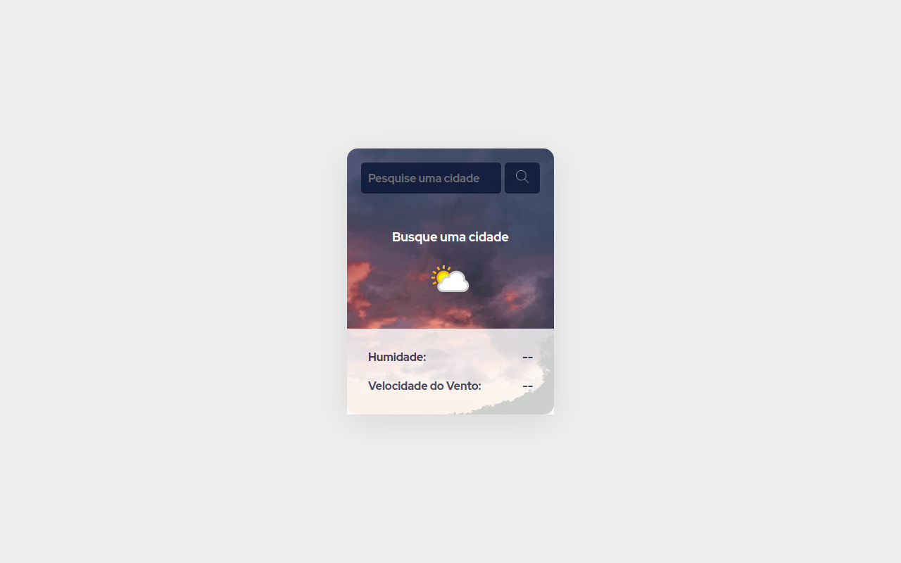

<h1 align="center"> Previsão do Tempo App </h1>

  <a href="#-tecnologias">Tecnologias</a>&nbsp;&nbsp;&nbsp;|&nbsp;&nbsp;&nbsp;
  <a href="#-projeto">Projeto</a>&nbsp;&nbsp;&nbsp;|&nbsp;&nbsp;&nbsp;
  <a href="#-layout">Layout</a>&nbsp;&nbsp;&nbsp;|&nbsp;&nbsp;&nbsp;
  <a href="#memo-licença">Licença</a>

  

 

  

## 🚀 Tecnologias

Esse projeto foi desenvolvido com as seguintes tecnologias:

- HTML e CSS
- JavaScript
- Consumo API
- Git e Github

## 💻 Projeto

O Projeto de Previsão do Tempo, consiste na construção de uma página para consulta meteorológica, sendo abastecida com dados da API do Weather API: [WeatherAPI](https://www.weatherapi.com/).

## 🔖 Layout

Você pode visualizar o projeto através [DESSE LINK](https://charles-previsaotempoapp.vercel.app/).

## :memo: Licença

Esse projeto está sob a licença MIT.

---